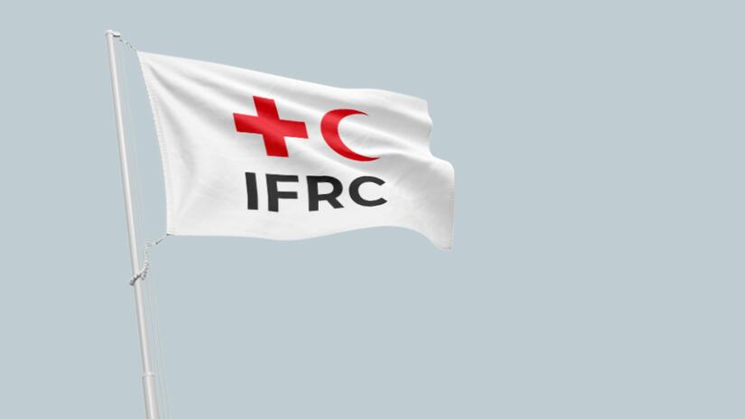
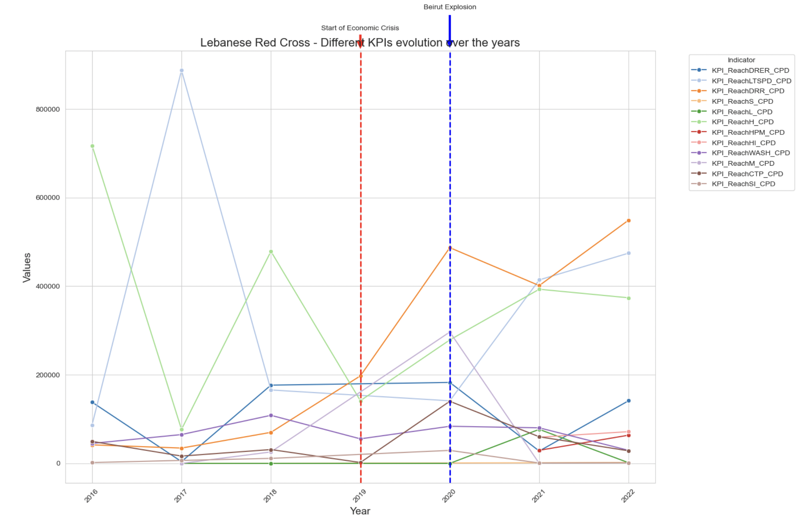
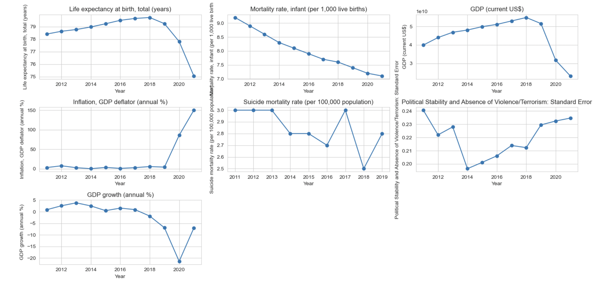
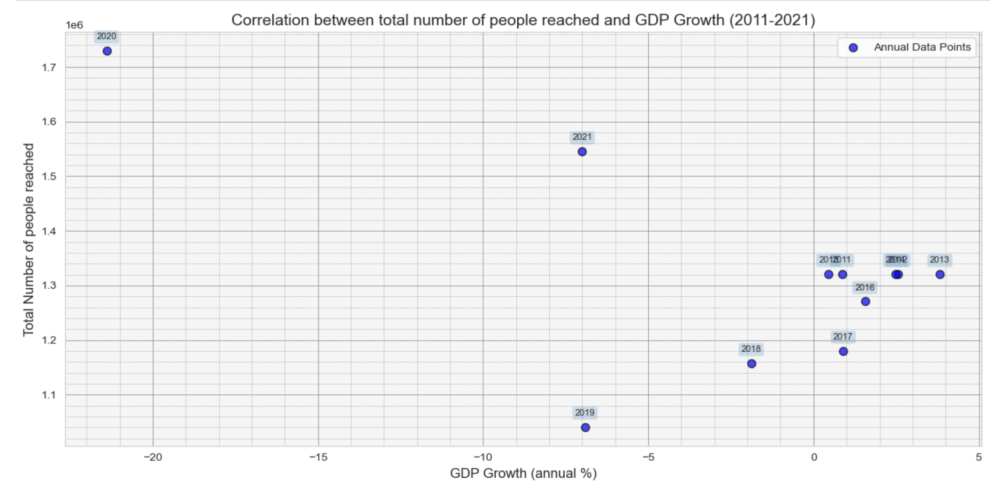
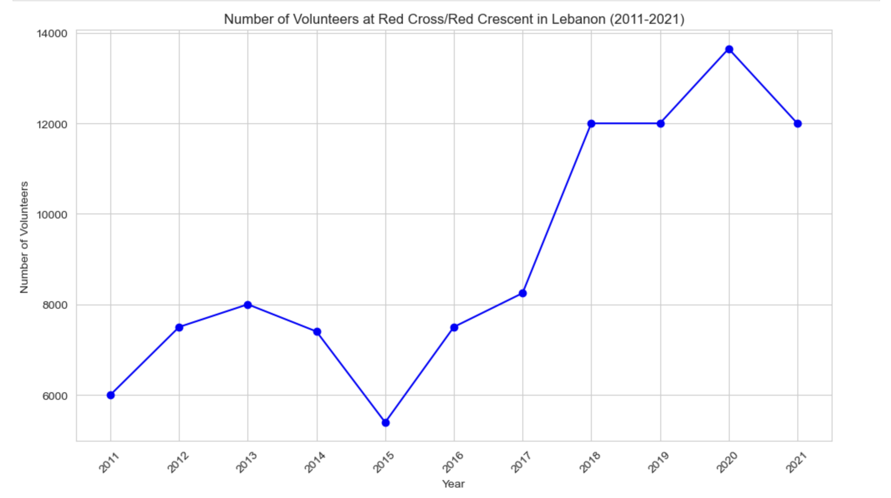
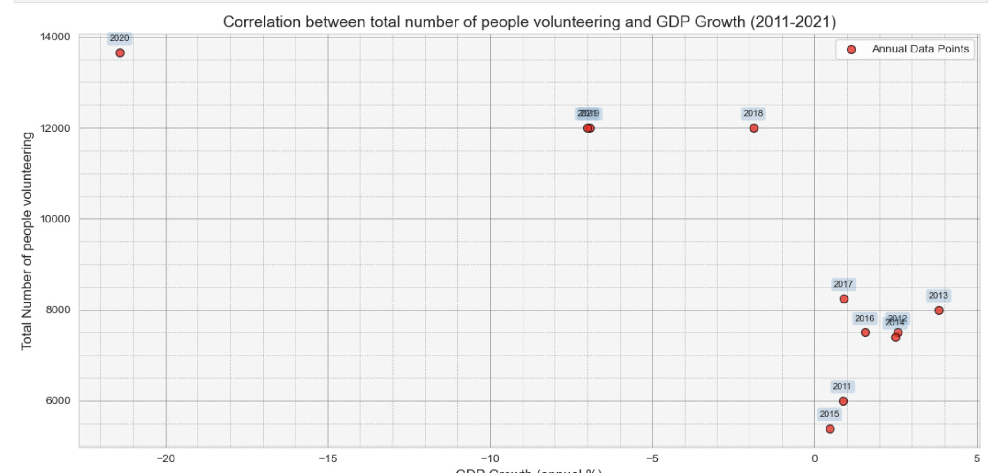
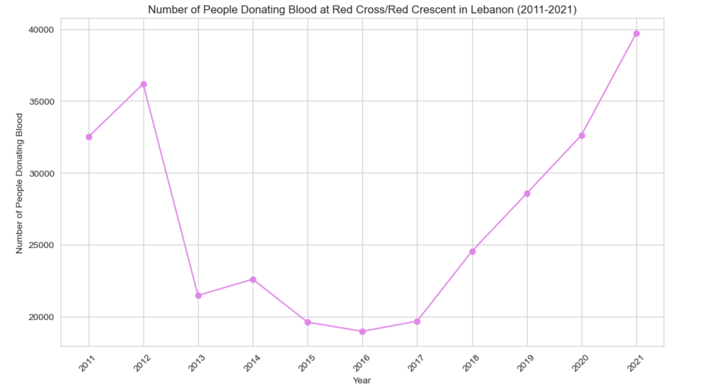
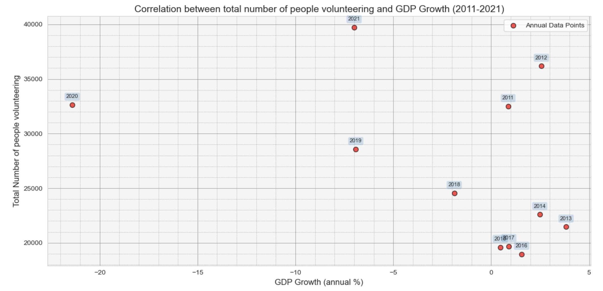

### Introduction

This data story provides a succinct analysis of the evolution of the number of individuals reached by the International Federation of Red Cross and Red Crescent Societies (IFRC) in Lebanon, with a special focus on the impact that the recent economic crisis has had on their outreach efforts. By examining the trends and changes in the numbers reached, the story sheds light on the challenges and successes of humanitarian efforts in response to the country's deteriorating economic conditions. Through this analysis, we aim to understand better how the economic crisis has influenced the IFRC's capacity to provide aid and support to those in need within Lebanon.

Source: Linkedin, Lebanese red cross

Source: IFRC website

### General Outlook

> This graph displays key performance indicators (KPIs) related to the number of people reached over the years in Lebanon.

The graph is a concise visualization of the Lebanese Red Cross's humanitarian efforts from 2016 to 2022, with lines representing different outreach indicators. Key events like the onset of the economic crisis and the Beirut explosion are highlighted. While most indicators decline post-2020, likely due to these events, there is a notable increase in the Disaster Risk Reduction (DRR) KPI. This uptick could be associated with intensified DRR activities in response to the Beirut explosion.

### Economic crisis
> Data from the World Bank on Lebanon was collected, cleaned, and utilized to examine the impact of the economic crisis on the IFRC's activities in the country.

Acknowledging that the data is for Lebanon, the graphs collectively illustrate the country's challenging period marked by an economic crisis starting in 2019. The sharp increase in inflation and severe contraction in GDP growth reflects this crisis, while the decline in life expectancy could be related to broader socioeconomic difficulties, including potential impacts on healthcare. Infant mortality rates continued to decrease, which may suggest some areas of public health managed to sustain improvements despite the crisis. The fluctuations in political stability and suicide rates could also be indicative of the societal stress during this period.

### Assessing the Impact of Economic Crisis on IFRC Interventions

The scatter plot illustrates the relationship between Lebanon's GDP growth (annual %) on the x-axis and the total number of people reached by certain programs or interventions on the y-axis, from 2011 to 2021. Each point represents a year's data.

The plot suggests a generally negative correlation; as the GDP growth decreases (even becoming negative), the number of people reached increases, particularly noticeable in 2020, a year with significant negative GDP growth and the highest number of people reached. This could imply that as economic conditions worsened, the need for humanitarian assistance rose. Conversely, years with higher GDP growth coincide with fewer people reached, possibly indicating less demand for assistance during more prosperous times. The outlier year 2020 likely corresponds to the economic collapse and possibly the Beirut explosion, reflecting a peak in aid requirements.

* * *

### Volunteerism Trends During the Economic Crisis: A Brief Analysis of Shifts in Public Engagement

The line graph depicts the number of volunteers at the Red Cross/Red Crescent in Lebanon from 2011 to 2021. We observe a variable trend over the years, with a significant dip in 2015. However, from this low point, there has been a remarkable and steady rise peaking in 2020. This peak suggests a surge in volunteerism, possibly as a response to heightened needs amid the economic crisis.

It is heartening to see the upward trajectory in volunteer numbers, culminating in a high point during a period of national hardship. This indicates a strong community spirit and willingness among the people to help each other in times of need, reflecting positively on the societal values of solidarity and resilience.

The scatter plot indicates a relationship between Lebanon's annual GDP growth and the total number of people volunteering from 2011 to 2021. Similar to the previous trend observed with the number of people reached by the IFRC, the number of volunteers also increases as the GDP growth declines, with a notable peak in volunteerism in 2020. This peak, amid significant economic contraction, reaffirms the earlier observation of heightened community engagement and volunteerism during times of crisis, suggesting a collective commitment to supporting those in need regardless of economic challenges.

### Trends in Blood Donation: Tracing the Evolution of Donor Participation

The first graph displays the correlation between the total number of people volunteering and Lebanon's GDP growth from 2011 to 2021. A noticeable trend is that the number of volunteers increases significantly during years of negative GDP growth, particularly in 2020, likely due to the economic crisis prompting more people to volunteer.

The second graph shows the number of people donating blood at the Red Cross/Red Crescent in Lebanon from 2011 to 2021. After a sharp decline around 2014, there has been a consistent increase, with a steep rise from 2019 onwards, indicating a growing willingness to donate blood despite or perhaps in response to the economic difficulties faced by the country.

Together, these graphs suggest that times of economic hardship have mobilized the Lebanese community, leading to a remarkable rise in both volunteering and blood donation, which can be seen as acts of solidarity and support for the community's well-being.

### Conclusion
To conclude, the data examined from various sources showcases the resilience and solidarity of the Lebanese community amidst economic adversity. Despite the challenging economic conditions, there has been an inspiring increase in the number of individuals assisted by the IFRC, in volunteerism, and in blood donations. These patterns indicate that in times of crisis, the spirit of cooperation and support within the community grows stronger, highlighting the essential role of humanitarian organizations in such times and the profound impact of collective human action. The Lebanese people's response to hardship serves as a powerful reminder of the inherent generosity and strength that surface when they are most needed.
